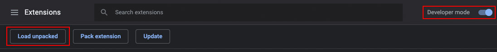
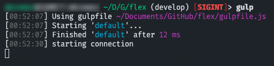
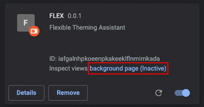

# (WIP) FLEX 💪 - a flexible theming assistant


-lightgrey)

## A simple browser extension to inject your code on the fly.  

### It does not require any special permissions and does nothing until you grant access to the current page by pressing its icon.

## 📝 Basic usage

1) Install this extension in your browser (tested in chrome but should also run in firefox)  
**🚨 NOT IN THE STORES YET 🚨** Scroll down and check the **Development** section
2) Setup a local WebSocket server - e.g. use [gulp-ws-server](https://www.npmjs.com/package/gulp-ws-server)
3) Point the server at whatever URL you set in the extension's options page
   - Default is `ws://localhost:3210/dev`

## 🚨 Important

Always start your WebSocket server **first**. Upon activation the extension will immediately attempt to connect to your server **once**.  
If that doesn't work, it will stay inactive. However, pressing the icon again will trigger another attempt.

## 📌 Use cases

1) You'll find one or two. Below is mine. :)
2) I do a lot of theming (CSS, JS) for our company's WordPress sites and it can become cumbersome to copy & paste the code and reload the page for every little change

## 🧩 Extension API

Communication between your project and the extension is made over WebSockets.  
You can use the following API to tell the extension what you want to do:

``` javascript
// Example of a JSON stringified object ready to be sent to the extension
const payload = JSON.stringify({
  type: "css",
  code: "body { color: red; }",
  removeNodes: [".selector", "link[href*='style.css']"]
})
```

| Key             | Type         | Values                       | Description                                                                        |
|-----------------|--------------|------------------------------|------------------------------------------------------------------------------------|
| type (required) | string       | css, js                      | Tells the extension what to do.<br>CSS will be updated without reloading the site. |
| code            | string       |                              | The code to be injected                                                            |
| removeNodes     | string array | any valid css selector       | The extension will attempt to remove these nodes from the DOM                      |
| blockResources  | string array | any valid resource path      | Note: Not implemented yet                                                          |
| debug           | bool         | true, false (default: false) | Note: Not implemented yet                                                          |


## 🤔 How it works

Upon activation, the extension injects a small script into the website's context.  
This script is what connects your project over the extension with the webpage.  

Now, whenever your WebSocket server is sending something, FLEX will try to understand that request and for example, remove nodes from the DOM and inject some CSS.  
*Tip: Often you can use the removal-feature to remove the original CSS resource and thus fully replace it with your local file*

## 🧾 Example gulp setup

``` javascript
const gulp = require("gulp")
const fs = require("fs")
const ws = require("gulp-ws-server")

// create WebSocket server
const wss = ws({
  port: 3210,
  path: "/dev",
})

const websocketTask = async () => {
  // read file contents
  const css = fs.readFileSync("./path/to/css/style.css", "utf8")

  // send message to extension
  await wss.send(
    JSON.stringify({
      type: "css",
      code: css,
      removeNodes: ["link[href*='style.css']"] // any valid CSS selector
    })
  )
}

const defaultTask = async () => {
  await gulp.watch(
    ["awesome-theme/less/**/*.less"], // watch files
    { ignoreInitial: false },
    gulp.series(websocketTask) // execute websocketTask when files change
  )
}

// send stuff on initial connection to client
wss.on("connection", (event) => {
  websocketTask()
})

exports.default = defaultTask

```

## 🤷‍♂️ Troubleshooting

When the badge says "FAIL", something went wrong...  
That usually means, that it can't connect to your project's WebSocket server. (Re)start your server and the extension.
Otherwise, check the background page of the extension. There's some logging that may help you.

## 💻 Development

After checking out the repo, you have to decide if you just want to work with the files in `addon/` of if you want a helpful dev workflow.  
If you go with the last, Node.js is required.

Install the extension in your browser by activating the devmode in `chrome://extensions/` and pressing `Load unpacked`. Locate the `addon/` directory from this project and you're done.



### Dev workflow

With Node.js installed, open up a terminal in the project's root directory and run `npm install`. After completion run `gulp`.

This will spin up a local websocket server which should immediately show `starting connection` in the terminal.



Now you can edit the files within `addon/`. Whenever you save a file, the extension will get automatically reloaded in the browser. If not, read on.

**Note: Sometimes the extension goes into idle mode. To resolve this, simply click on the "background page" link which will open a devtools window. Keep it open.**  
That will prevent your extension from becoming idle.



Happy coding! 🍻

## 🤝 Contributing

Feel free to contribute in any way. If I see an improvement for this tool, I'd be glad to add it.

## 🆘 Support

If you experience any problems, contact me or open an issue.  
I will try to respond asap.

## ⚖️ Disclaimer

There's no warranty, liability whatsoever.
